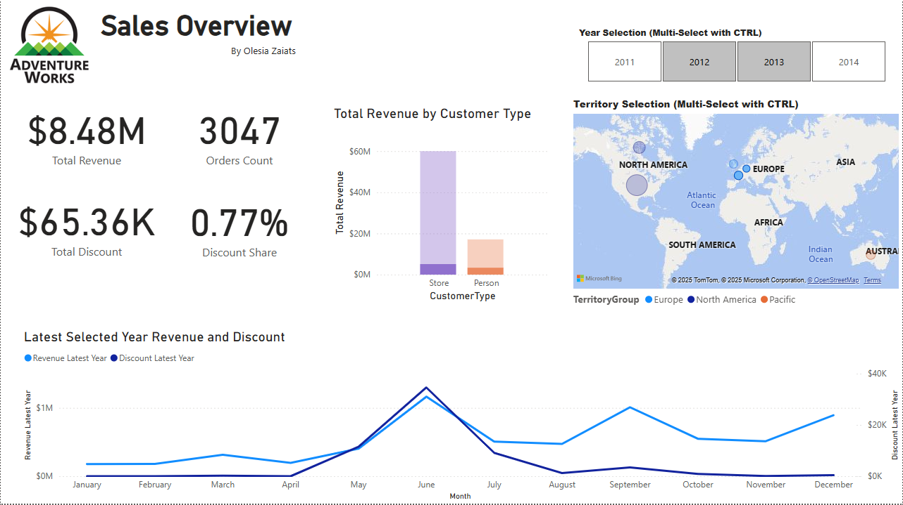
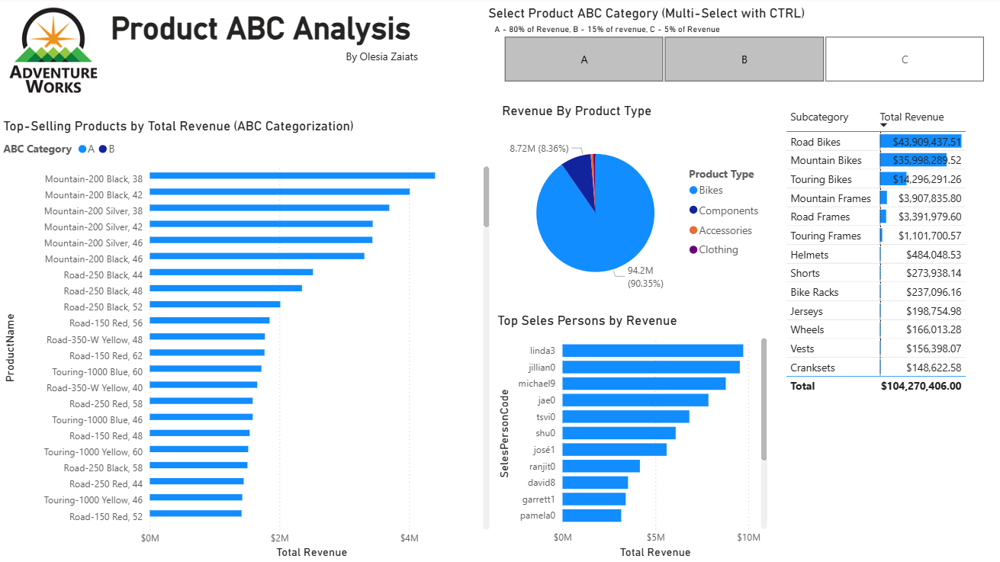
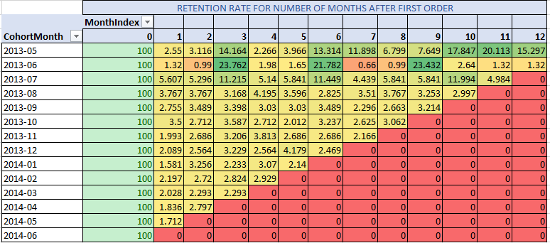

# Data Analyst Portfolio by Olesia Zaiats

Welcome to my data analyst portfolio. This repository showcases my technical skills in SQL, Power BI, and data modeling by solving real-world business problems using open data.

My primary tools include:
- Microsoft SQL Server
- Power BI
- DAX and T-SQL
- Dimensional modeling and star schemas
- Analytical techniques such as ABC, RFM, cohort analysis

I'm passionate about turning raw data into actionable insights and presenting those insights through clear, interactive dashboards and reports.

## Featured Projects

### [Sales Insights](./projects/sales-insights/)
#### Summary
This project presents a full-cycle Business Intelligence (BI) solution using Microsoft SQL Server and Power BI. Data was transformed into a star schema and visualized through interactive, user-friendly dashboards.

#### Objectives
1. Analyze sales performance across multiple dimensions
2. Assess product and category contribution to total revenue
3. Apply BI best practices on real-world-style data
4. Showcase advanced skills in SQL, data modeling, and dashboard design

#### The Scope and Types of Data Used
- Normalized Sales, Customer, Product, and Geography data from AdventureWorks2022 database
- Created fact and dimension views in SQL Server via T-SQL
- Used DAX in Power BI for metrics, ABC classification, and time-based filtering.

#### Challenges Faced and Solutions Implemented

| Challenge | Solution |
|----------|----------|
| AdventureWorks schema is highly normalized and not suitable for analytics | Created custom SQL views to build a star schema with clear fact and dimension tables |
| Complex relationships between tables in raw data | Defined accurate relationships in Power BI to ensure model integrity |
| Need for product-level revenue classification (ABC analysis) | Implemented dynamic ABC segmentation using DAX based on cumulative revenue share |
| Show only the latest selected year in time series visuals | Used DAX time intelligence to dynamically identify and filter to the latest selected year |

#### Final Outcomes
Delivered two interactive dashboards highlighting sales trends and product performance. 
##### Sales Overview Dashboard  

##### Product ABC Analysis Dashboard  

Demonstrated skills in data modeling, DAX, and BI visualization.

### [Customer Cohort Retention](./projects/customer-cohort-retention/)
#### Summary
This project explores monthly customer retention using cohort analysis based on first purchase date. The SQL-based logic segments customers and measures their engagement over time, with results visualized in Excel.

#### Objectives
- Identify customer cohorts by first order month
- Track monthly retention performance
- Visualize retention matrix using a heatmap
- Apply business-oriented analysis using SQL and Excel

#### The Scope and Types of Data Used
- MS SQL Server with AdventureWorks2022 database T-SQL query for calculating cohorts and retention rate
- Data for resulting cohorts analysed and visualised in Microsoft Excel (Pivot Tables, Heatmap)

#### Challenges Faced and Solutions Implemented
| Challenge | Solution |
|-----------|----------|
| Data sparsity and irregular customer orders | Limited analysis to the most stable period (July 2013 - June 2014) for reliable insights |
| Visualizing retention matrix in a clear, intuitive format | Created heatmap in Excel pivot table using conditional formatting |

#### Final Outcomes
The cohort analysis revealed that most customers make only one purchase, with retention dropping below 30% after the first month. However, a small loyal segment (~5�10%) continues to return over several months. Some cohorts from late 2013 showed stronger retention, possibly due to seasonality or marketing campaigns. These insights can help target retention strategies and identify high-value customer groups.

##### Retention Heatmap Preview  

## SQL Practice(./practice/hackerrank/sql/)
In this folder presented my submissions for most interesting hackerrank challenges.
The examples demonstrates usage of advanced SQL techniques like window functions, different types of joins and aggregations.

## Certificates
Here is the links to certificates I have so far:
- SQL Basic https://www.hackerrank.com/certificates/3355de57f9ed
- SQL Intermediate https://www.hackerrank.com/certificates/ad3a139d6bed
- SQL Advanced https://www.hackerrank.com/certificates/7307b0dca860

## About Me

I specialize in transforming complex business data into meaningful insights using modern BI tools. My focus is on:

- Clean, well-structured SQL pipelines
- Intuitive and business-ready Power BI dashboards
- Applying the right analytical technique for the problem

Connect with me:
- [LinkedIn](https://www.linkedin.com/in/olesia-zaiats-5362a237b)
- [GitHub](https://github.com/zaiats-olesia)
- Email: zaiats.olesia@gmail.com